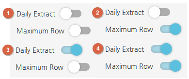
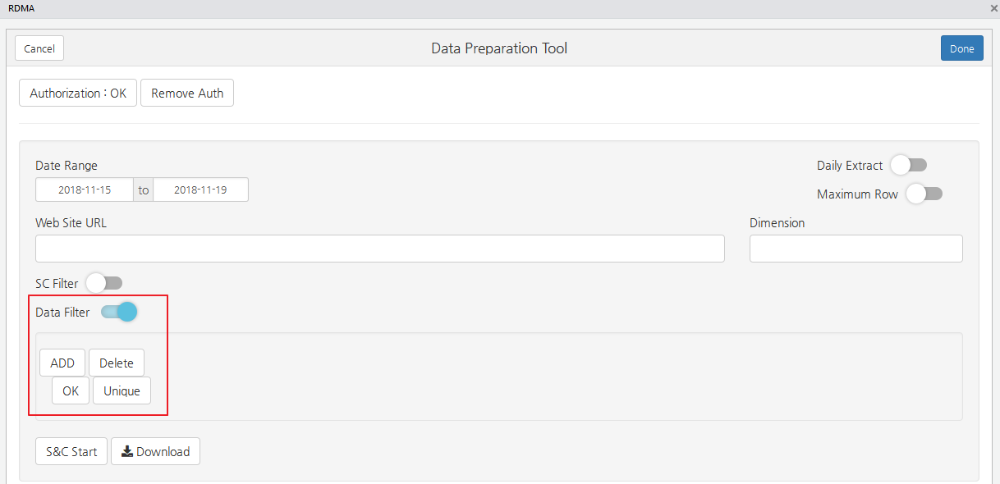
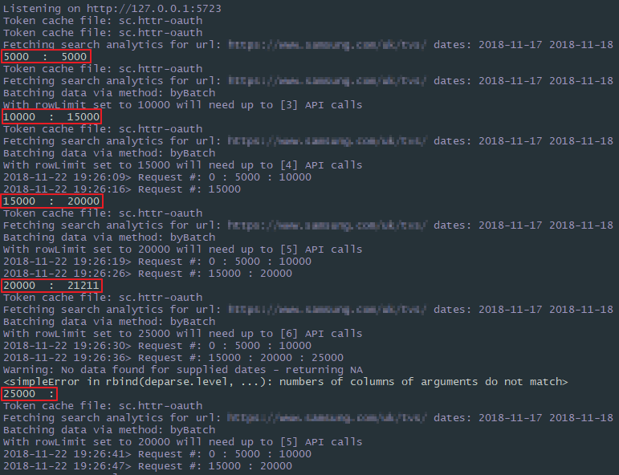
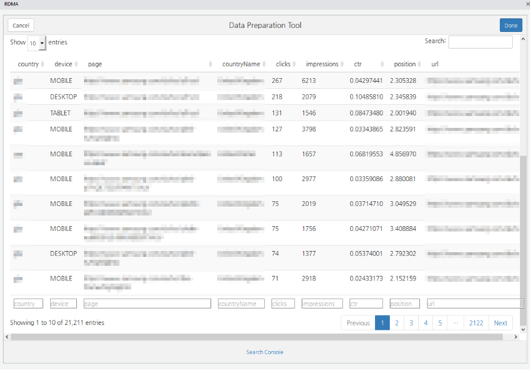

# RDMA Update

## GSC RDMA Package Download

```
- 기존 RDMA
library(devtools)
install_github('gmlgml1230/RDMA')

- GSC RDMA
library(devtools)
install_github('gmlgml1230/RDMA', ref = 'gsc')
```

- 기존의 RDMA에는 GSC가 업데이트되어 있지 않음
- GSC RDMA에는 Adwords, Omniture, Analytics를 제외 후 GSC만 있음

## Update List

1. Adwords, Omniture, Google Analytics Tap 제거
    - 기존 코드가 너무 길고 정리되어있지 유지보수의 어려움이 있기 때문에 GSC만 남기고 모두 제외 시켰습니다.
    - 이전의 Adwords, Omniture, Analytics를 사용하고자 한다면 기존의 RDMA를 다운로드하여 사용하면 됩니다.

2. GSC API 업데이트 사항
    - GSC API 업데이트로 많은 데이터 추출이 가능해졌습니다.
    - 데이터 추출 기준 : byBatch, byDate
      > byDate : 일 별로 5000개의 데이터를 추출하며, byBatch보다 Clicks = 0 인 데이터에 대해 더 많은 Impression을 가집니다.  
      > byBatch : 전체 기간에 대해 RowLimit 갯수의 데이터를 가지고 올 수 있으나, 설정 기간의 데이터양을 알 수 없기 때문에(Google API에서 제공하지 않음) RowLimit을 점차 증가시키면서 데이터를 추출해야한다.

3. GSC RDMA 업데이트 사항
    - 데이터 추출 방법 추가
      > 1. 설정 기간에대해 5000개의 데이터 추출(기존 방식과 동일)
      >     - 데이터 추출 속도가 가장 빠릅니다.
      > 2. 설정 기간에대해 최대 10만개까지 데이터 추출
      >     - 설정 기간의 데이터양이 총 10만개라면 최대 30분정도가 걸립니다
      > 3. 설정 기간에대해 일 별 5000개씩 데이터 추출
      > 4. 설정 기간에대해 일 별 최대 데이터 추출
      >     - 일 별 데이터가 5000개이상일 경우 일 별 최대 10만개까지 데이터 추출

    - 데이터 추출 방법 선택 기준
      > - 데이터의 양이 많이 필요없을 경우 1번을 선택  
      > - 데이터 추출 기간이 길면 2번, 데이터 추출 기간이 약 2달 정도인데 데이터가 많을 것으로 예상된다면, 4번이 좀 더 빠를 수 있습니다.

          

4. 필터링 기능 수정
    - 기존 필터기능의 필터 추가 및 제거 시 기록해둔 정보가 지워지는 현상 수정

5. 데이터 중복 제거
    - 데이터 추출 기준을 일 별로 선택했다면 같은 기준을 가진 데이터가 많아져 다운로드 속도가 오래 걸릴 수 있습니다. 일 별 데이터 추출 시 Data Filter안에있는 unique버튼을 클릭하면 데이터 중복 처리를 진행합니다.  
    - ctr : Total Clicks / Total Impressions  
    - position : Total Position(Impressions*Position) 생성 후 Total Position /  Total Impressions  
    


6. Console log
      - 네모 칸 왼쪽 RowLimit, 오른쪽 데이터 추출량
      



